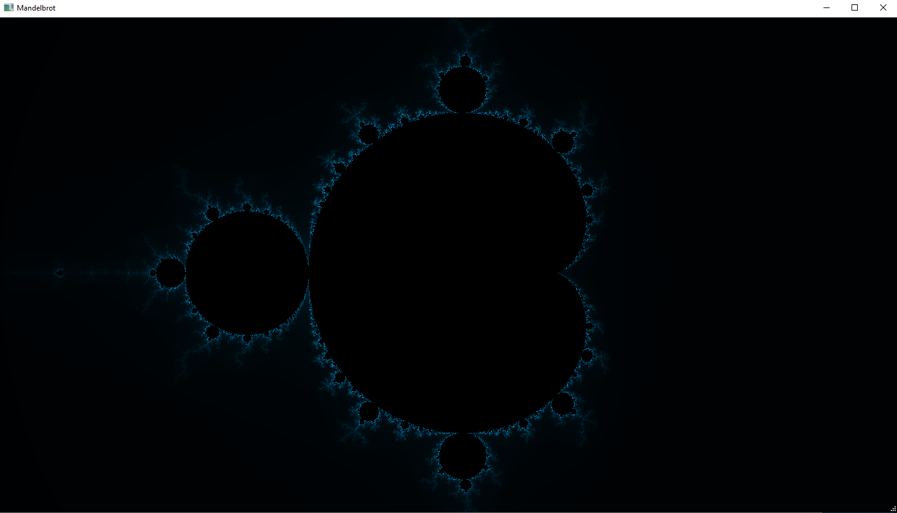

# Mandelbrot set visualization
This program visualises Mandelbrot set (https://en.wikipedia.org/wiki/Mandelbrot_set), using multithreading calculation 
for faster rendering and cached data for already rendered pieces of the coordinate plane

## Program features
 * Zooming
 * Movement along the coordinate plane
 * Screen resolution adaptability

## How to run
* __qmake__ with `mandelbrot.pro`
  

* __cmake__ with Qt6 and `CMakeLists.txt`
    > To run with __cmake__ in __CLion__ do not forget to set _-DCMAKE_PREFIX_PATH=<path_to_your_Qt6_cmake_dir>_ in ```File | Settings | Build, Execution, Deployment | CMake | CMake options```

## Optimizations
* Divide window space in pieces and multithreaded calculate each piece of coordinate plane.
* Use cache for already calculated pieces, if scale haven't changed. 
* Can adapt to size of screen by calculating optimal pieces size, that affect minimal granularity for the first moments of rendering new image.

##Some screenshots

#### Initial screen


#### Example #1


#### Example #2


#### Example #3
